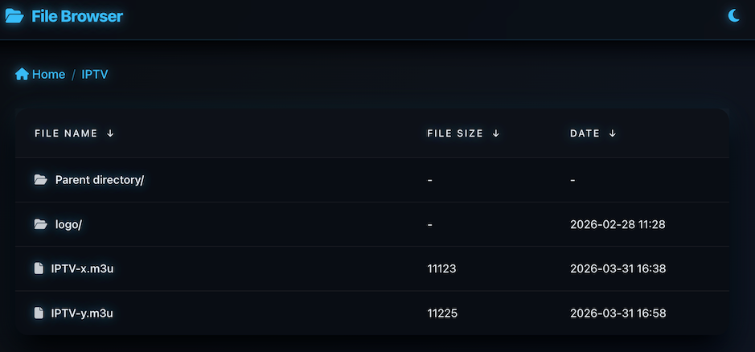
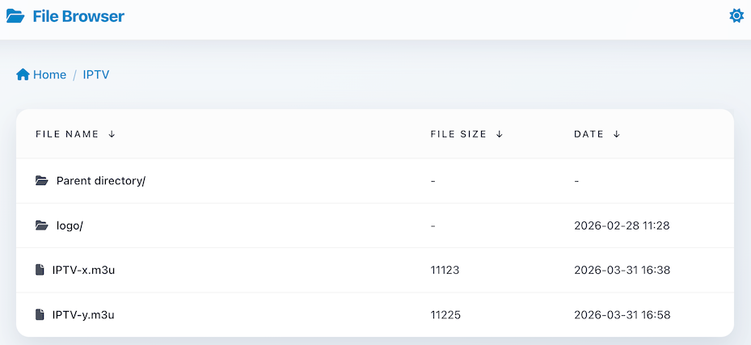

# 🌌 CyberIndex - Fancyindex Modern Theme
> A geeky, modern, zero-jQuery, pure Vanilla JS interactive theme built for Web File Browsers (Based Nginx FancyIndex).

## 📸 Screenshots

| **🌙 Dark Mode**                                | **☀️ Light Mode**                                 |
| ----------------------------------------------- | ------------------------------------------------- |
|  |  |


## ✨ Features

### 🌗 Seamless Day/Night Theme

Automatically detects the system's preferred color scheme (Dark/Light Mode).

Includes a manual toggle in the top navbar with localStorage memory for a flicker-free navigation experience.

Dark Mode: Features a deep blue Cyberpunk aesthetic with neon glow and frosted glass effects.

Light Mode: Delivers a crisp, clean, and minimal reading experience.

### ⚡ Lightning Fast & Modern

Zero Bloat: Completely ditched jQuery in favor of pure Vanilla JS for maximum performance and 0 redundant dependencies.

Built on the latest Bootstrap 5.3.8 for a fluid, responsive layout that looks stunning on both desktop and mobile devices.

### 🗂️ Smart Interactions

Intelligent Sorting: Completely rewrote the clunky default sorting logic. Click any table header to smartly toggle between ascending and descending order, complete with sleek neon arrow indicators.

Dynamic Breadcrumbs: Automatically generates a clickable breadcrumb navigation path based on the current URL.

Smart Icon Mapping: Utilizes native FontAwesome 6 to automatically assign modern icons to hundreds of file types based on their extensions.

### 🖼️ Deep Lightbox Integration

Seamlessly integrates GLightbox for borderless image zooming and previewing directly within the browser.

Features a custom-built, full-width frosted glass description bar that perfectly blends with the theme's UI logic.

## 🛠️ Installation & Deployment

This theme is perfectly suited for acting as the frontend face of your Nginx Autoindex or FancyIndex module.

1. Directory Structure

Clone or download the project files into a /theme/ folder at the root of your website:

your-website-root/
│
├── theme/               # Core theme folder
│   ├── css/
│   │   └── theme.css    # Core stylesheet (Day/Night variables & glow effects)
│   ├── js/
│   │   └── app.js       # Core interaction logic (Sorting, Breadcrumbs, Theme Toggle)
│   ├── header.html      # Header injection file
│   └── footer.html      # Footer injection file
│
└── Other website files...

2. Nginx Configuration Example (For FancyIndex)
Add the following configuration to your Nginx server or location block to instruct Nginx to load the theme:

```nginx
location / {
    # Enable FancyIndex module
    fancyindex on;
    # Display exact file sizes (turn off to display KB/MB)
    fancyindex_exact_size off;
    # Display local time
    fancyindex_localtime on;
    
    # 🌟 Mount the theme's header and footer
    fancyindex_header "/theme/header.html";
    fancyindex_footer "/theme/footer.html";
    
    # Ignore the theme folder itself to hide it from the file list
    fancyindex_ignore "theme";
}
```

## ⚙️ Dependencies

This project relies entirely on CDN links, eliminating the need to store bulky frontend libraries on your local server and maximizing load speeds:

- [Bootstrap 5.3.8](https://getbootstrap.com/) (UI Framework & Grid System)
    
- [Font Awesome 6.5.1](https://fontawesome.com/) (Modern Vector Icons)
    
- [GLightbox](https://biati-digital.github.io/glightbox/) (High-performance native JS image lightbox)

## 📄 License

This project is open-sourced under the **MIT License**.

You are free to use, modify, and distribute it.


